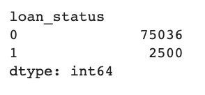
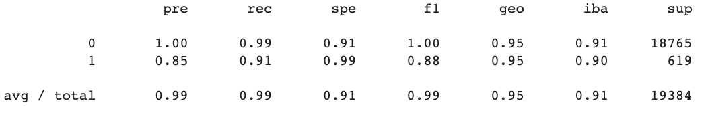
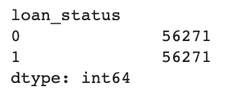
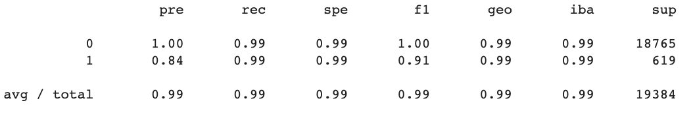

# Project Description
The following analysis consist of a credit risk classification, where I analyze the numbers of healthy loans and compared to risky loans. 

## Instructions

This section divides the steps for this Project, as follows:
* Step 1: Split the Data into Training and Testing Sets
* Step 2: Create a logistic Regression Model with the Original Data
* Step 3: Predict a Logistic Regression Model with Resampled Training Data
* Step 4: Write a Credit Risk Analysis Report

# Outline
- [Part 1: Split the Data](#part-1-split-the-data)
- [Part 2: Create a Logistic Regression Model with the Original Data](#part-2-create-a-logistic-regression-model-with-the-original-data)
- [ Part 3: Predict a Logistic Regression Model with Resampled Training Data](#part-3-predict-a-logistic-regression-model-with-resampled-training-data)
- [ Part 4: Credit Risk Analysis Report](#part-4-credit-risk-analysis-report)

# Packages and Requirements
In order to run the code make sure you are in the `dev` environment. To create a `dev` enviroment that runs python 3.7, go to your terminal and:
`conda create -n dev python=3.7 anaconda`
Once the enviroment is created just go to your terminal and type `conda activate dev` and to deactivate enviroment, `conda deactivate dev`.
If you have any running the code, please go to the `requirements.txt` file and make sure to install the require packages and libraries as follow;

# Analysis

##  Part 1: Split the Data
The first step of the analysis was separating the data. On a dataset that consist of columns such as; loan size, interest rate, etc. I created a new dataframe, that would only consist of the loan status. A column that have inputs such as `1` and `0`. Where `1 = high risk loan ` and `0 = healthy loan.` Once that was done, my next step was to count the amount of value counts in the y column. As we can see there is a big difference between `1` and `0`. The result can see down below;

##  Part 2: Create a Logistic Regression Model with the Original Data
The second part of my analysis, I imported Logistic Regression from sklearn. I then predicted the data by using the testing features (X_test) and the fitted model. Once that was done, I evaluated the model to see its accuracy and the model showed me a `accuracy = 0.952.` After checking its accuracy, I printed the classification report, and what we could obsevre are the the columns 'pre' and 'rec'

The conclusion that we can make out of this model is that the model does pretty well. Cosindering that we never resampled the data for the for the data to have same parameters, the model predicted 85% of `1 = high risk loan ` , with an accuracy of 95%.

##  Part 3: Predict a Logistic Regression Model with Resampled Training Data
So after running a prediction model with the original data, i then resampled the data so that the numbers of `1 = high risk loan ` and `0 = healthy loan` are euqal as the image below shows; 

After resampling the model I calculated its accuracy to see how it compares to the first model with the original data. And the accuracy of the model is `accuracy = 0.993.` Which is very impressive and even higher than the original data, that has an accuracy of `accuracy = 0.952.`
After checking its accuracy, I printed the classification report, and what we could obsevre are the the columns 'pre' and 'rec'

##  Part 4: Credit Risk Analysis Report
Now that we have both models, the first with the original data and the second model with the data resampled. We can say that both models do fairly well. And the second model does pretty well even with the data resampled. The accuracy of the second model reaches 99% while the model predicted 84% of `1` values. While the first model had an accuracy of roughly 95% while predicting 85% of `1` values. The main difference is that the second model had a recall of 99% for `1` values, while the first model had a recall of 91%  for `1` values.
